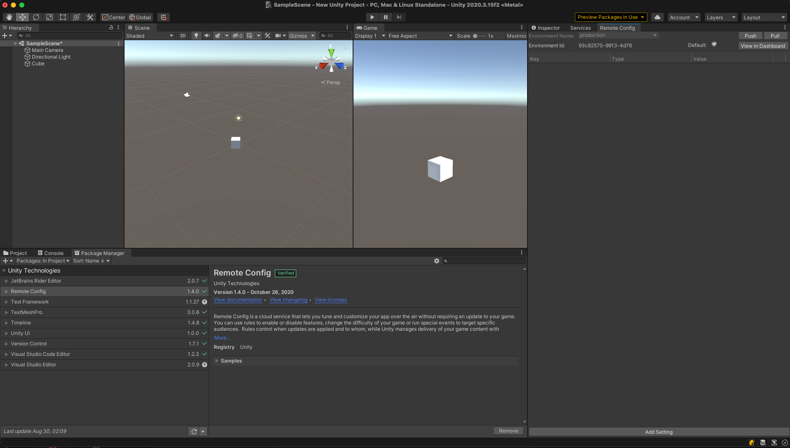
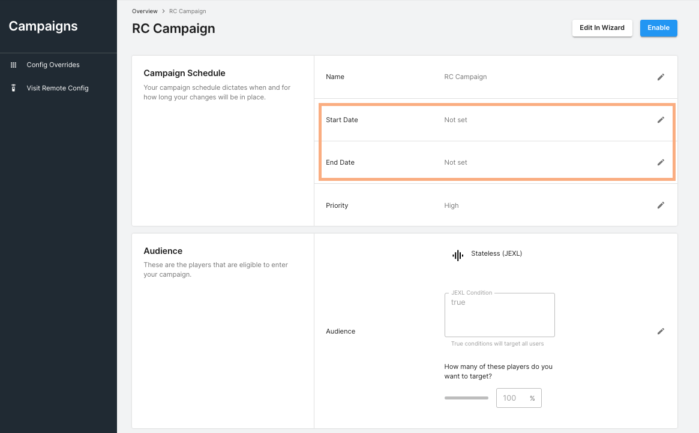
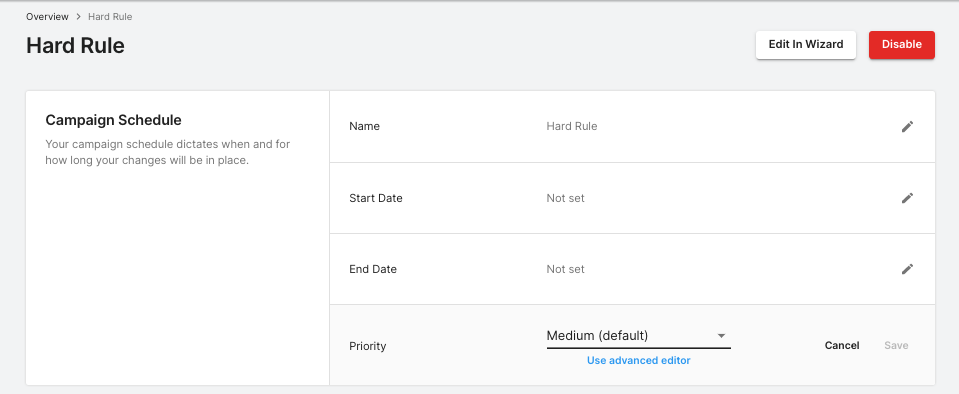
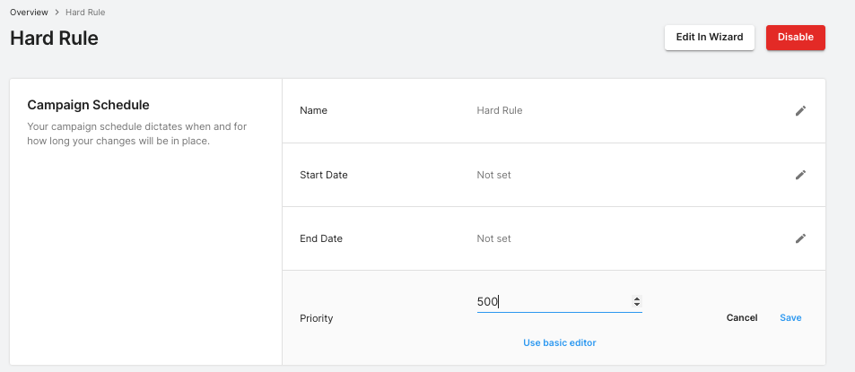
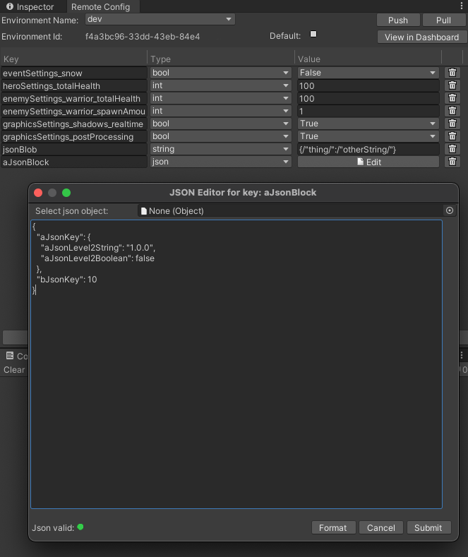
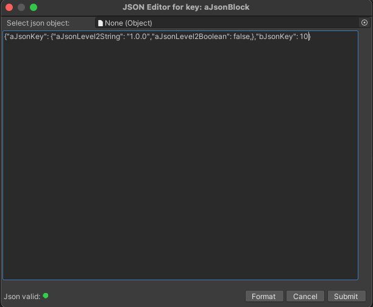
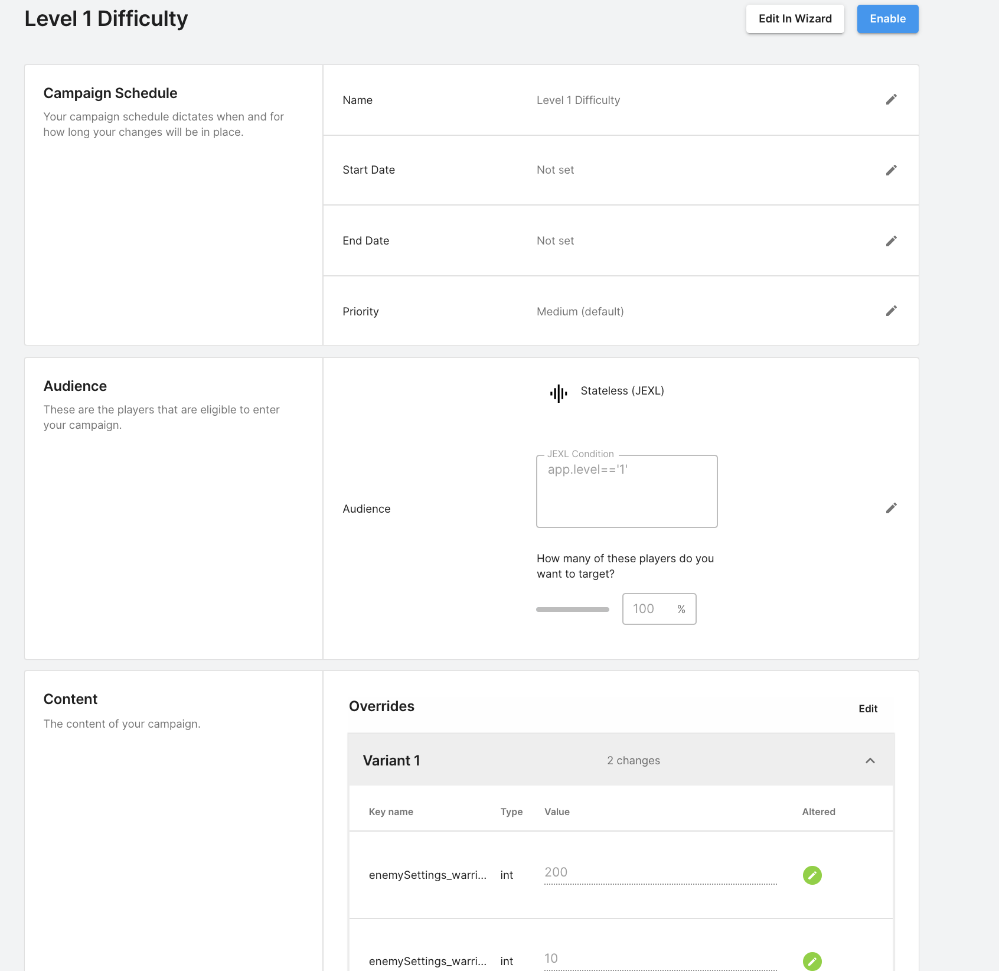
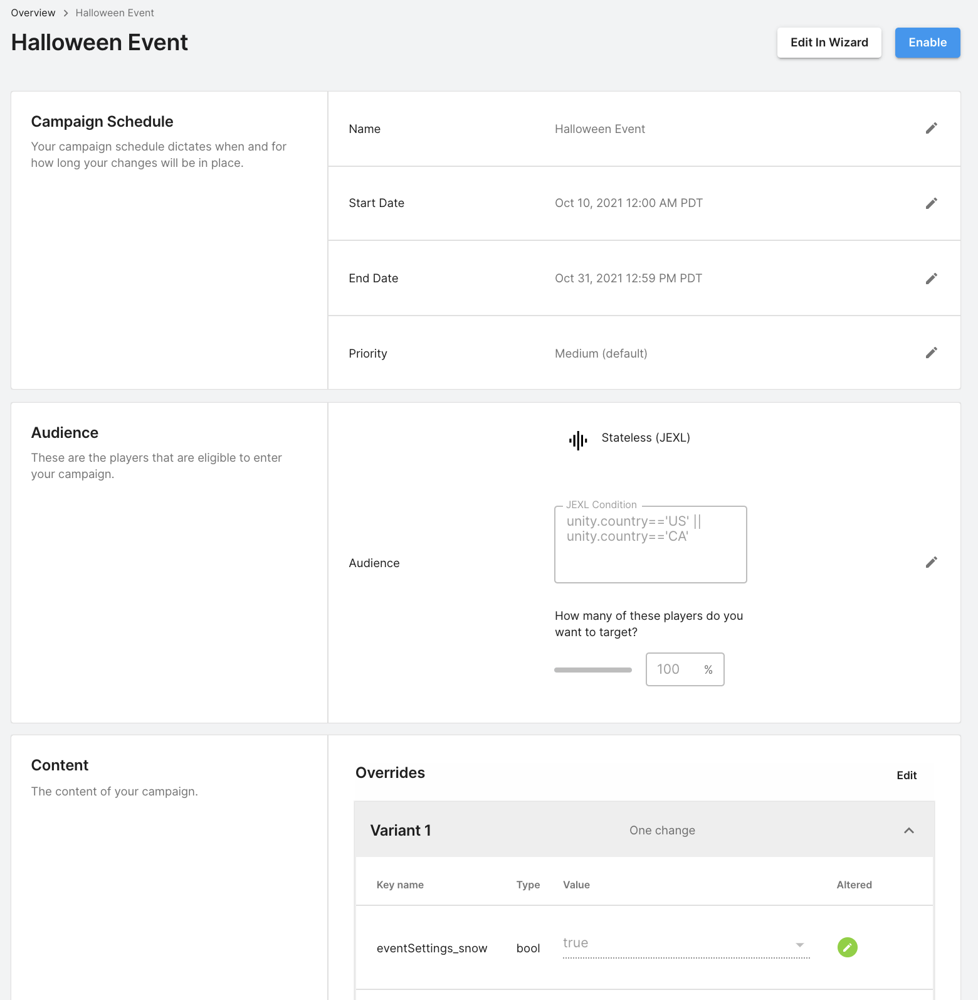
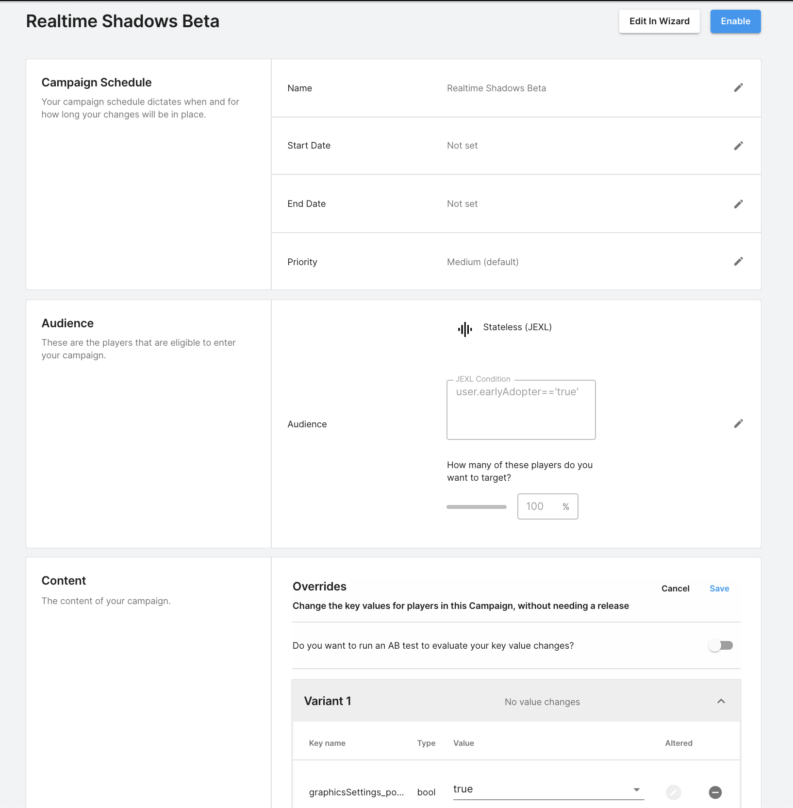
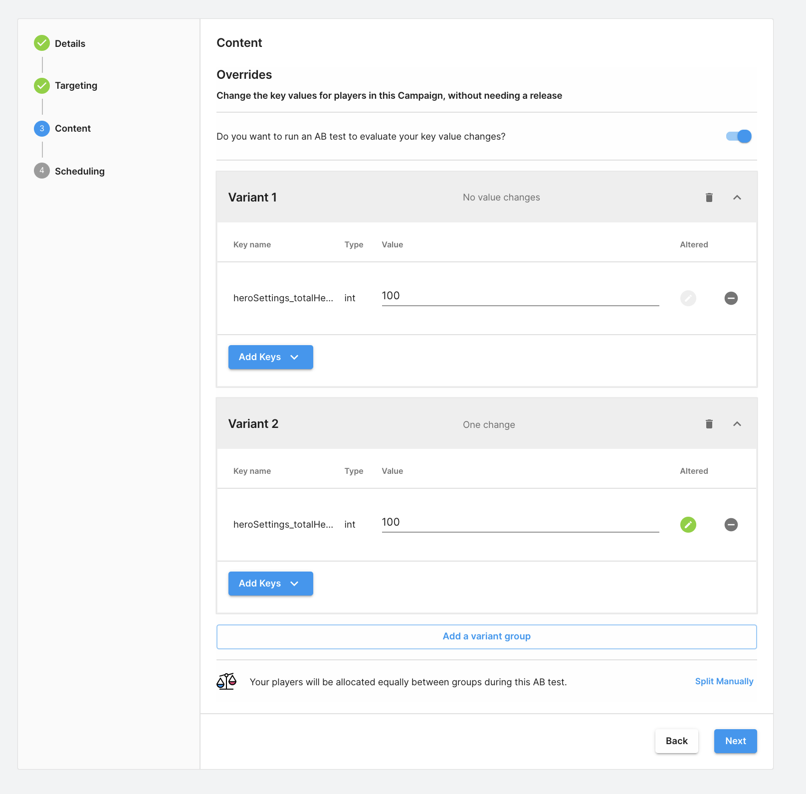

# Campaigns and Settings

Unity Remote Config uses __Campaigns__ to target specific user groups and deliver different settings for each group. Campaigns are linked to __Settings__, which you’ll map to variables in your game code to override their default values when the audience criteria for a Campaign is met.

Configure Remote Config settings early, when you design your game or before a new deployment. Unity recommends including inert Remote Config settings within your initial deployment, which you can later apply once you understand how your audience uses your game, and how it performs on different devices.

In the Unity Editor, select **Window** > **Remote Config** to open the **Remote Config** window to begin working with Settings.



Use the **Remote Config** window to configure your Remote Config Settings. Campaigns can be configured in the web Dashboard through the **Open Dashboard** button.  Campaigns dictate conditions or player segments through Settings. By default, you start with one config **Settings Config**. This config contains the default Settings that all users receive unless an active Campaign with [higher priority](#prioritizing-Campaigns) applies.

**Important**: Each [Environment](ConfiguringYourProject.md#remote-config-environments) has a unique Campaigns set. Before configuring Campaigns for your game, make sure you select the correct Remote Config Environment in the **Remote Config** window.

A Setting is a key/value pair. You'll map the key name to a variable in your game code so you can dynamically change its value without changing your code.

## Adding new Settings
The default **Settings Config** config contains every Setting you create for a given Environment. To create a new Setting, highlight the **Settings Config** config, then click the **Add Setting** button at the bottom of the right panel.

**Note**: You must create Settings in the Editor, since that is where the game code can consume them. However, once you’ve created Settings in the game binary, you can also update them using the Remote Config [REST APIs](RESTAPI.md) or the Remote Config [Web Dashboard](WebDashboard.md).

Each Setting consists of a **Key**, **Type**, and **Value**:

| **Parameter** | **Description** | **Example** |
| ------------- | --------------- | ----------- |
| **Key** | The name of the Setting, which must adhere to the following Campaigns:<br><br><ul><li>Must be unique within its environment.</li><li>Must start with a letter.</li><li>May only contain letters, digits, periods, underscores, or hyphens.</li><li>May not exceed 255 characters.</li></ul> | <ul><li>`enemyHealth`</li><li>`eventPackPrice`</li><li>`enableBetaFeature`</li></ul> |
| **Type** | The C# variable data type of the Setting value. Supported types include:<br><br><ul><li>`Int`</li><li>`Float`</li><li>`Bool`</li><li>`String`</li><li>`Long`</li><li>`JSON`</li></ul> | <ul><li>`int`</li><li>`float`</li><li>`bool`</li><li>`string`</li><li>`long`</li><li>`json`</li></ul> |
| **Value** | The value for this Setting, which must adhere to the following Campaigns:<br><br><ul><li>Int values are 32-bit integers (–2147483648 to 2147483647).</li><li>Float values are single-precision, 32-bit floating-point numbers.</li><li>Strings are limited to 10000 characters.</li><li>Booleans can only be true or false.</li><li>Long values are 64-bit signed integers (-9,223,372,036,854,775,808 to 9,223,372,036,854,775,807)</li><li>JSON value is any valid JSON supported by ECMA-404 standard</li></ul> | <ul><li>`100`</li><li>`4.99`</li><li>`true`</li><li>`‘jack-o-lantern’`</li><li>`123456789012345`</li><li>`{"jsonKey1": {"jsonSubKey1": "on","jsonSubKey2": "off"}}`</li></ul> |


## Adding new Campaigns
To create a new Remote Config Campaign, click **Open Dashboard** to open your browser and direct you to the Remote Config page, then click **Add Campaign**. Each Campaign has five parameters, which are detailed below:

* [Name](#name)
* [Condition](#condition)
* [Rollout Percentage](#rollout-percentage)
* [Start Date and Time](#start-date-and-time)
* [End Date and Time](#end-date-and-time)

The legacy rule types are still supported for delivery, however creation, editing, and deletion has been deprecated. There is a one-click conversion flow for legacy rule types to the new campaigns system through the Remote Config Dashboard.


* [Legacy Rule Type - Segmentation](#rule-type-segmentation)
* [Legacy Rule Type - Variant](#rule-type-variant)

### Name
The **Name** is the name for your Campaign. For example, you might name a difficulty curve Campaign `level_1_enemies`, or a seasonal event Campaign `halloween_event`.

### Condition
The **Condition** is a JEXL expression (see **JEXL support** section below) of contextual data attributes used to define the audience for which you want a Campaign to apply. You can use multiple criteria to define this segment. Remote Config currently supports three attribute categories:

* The **user** category contains custom developer-defined attributes that describe the user (for example, subscriber status, name, age), which you must pass to [ConfigManager.FetchConfigs<T, T2>(T userAttributes, T2 appAttributes)](https://docs.unity3d.com/Packages/com.unity.remote-config-runtime@3.0/api/Unity.RemoteConfig.ConfigManager.html).

  **Note:** When using `SetCustomUserId`, the ID you pass in is automatically attached to your `user` attributes as `customUserId`. See the [REST API documentation](https://remote-config-api-docs.uca.cloud.unity3d.com/#tag/Campaigns/paths/Campaigns?projectId={projectId}/post) for more details.

* The **app** category contains custom developer-defined attributes that describe the application (for example, connectivity status, app version, current level), which you must pass to [ConfigManager.FetchConfigs<T, T2>(T userAttributes, T2 appAttributes)](https://docs.unity3d.com/Packages/com.unity.remote-config-runtime@3.0/api/Unity.RemoteConfig.ConfigManager.html).
* The **unity** category contains predefined attributes, detailed in the table below:

| **Attribute** | **Description** | **Example** |
| ------------- | --------------- | ----------- |
| `unity.appBuildVersion` | The build number your application is running (set this in the Editor by navigating to **Edit** > **Project Settings** > **Player**). | `unity.appBuildVersion == '1'` |
| `unity.appVersion` | The version your application is running (set this in the Editor by navigating to **Edit** > **Project Settings** > **Player**). | `unity.appVersion == '1.0'` |
| `unity.cpu` | The name of the cpu processor. | `unity.cpu == 'Intel(R) Core(TM) i7-7920 HQ CPU @ 3.10GHz'` |
| `unity.cpuFrequency` | The processor frequency in MHz of the device running your app. | `unity.cpuFrequency >= 3100` |
| `unity.country` | The applicable country. This attribute uses [ISO 3166-1 alpha2](https://en.wikipedia.org/wiki/ISO_3166-1_alpha-2) country codes.<br><br>See documentation on [Code integration](CodeIntegration.md) for information on defining custom attributes. | `unity.country == 'US'` |
| `unity.language` | The applicable language. This attribute uses [ISO 639-1](https://en.wikipedia.org/wiki/List_of_ISO_639-1_codes) language codes.<br><br>See documentation on [Code integration](CodeIntegration.md) for information on defining custom attributes. | `unity.language == 'en'` |
| `unity.osVersion` | The operating system version of the device running your app. | `unity.osVersion == 'Mac OS X 10.14.4'` |
| `unity.platform` | The applicable device or platform. The following values are valid:<br><br><ul><li>`Android`</li><li>`iOS`</li><li>`Linux`</li><li>`macOS`</li><li>`PS4`</li><li>`PS5`</li><li>`Switch`</li><li>`WebGL`</li><li>`Wii`</li><li>`Windows`</li><li>`XboxOne`</li><li>`XboxSeriesS`</li><li>`XboxSeriesX`</li></ul> | `unity.platform == 'iOS'` |
| `unity.timeSinceStart` | The time in milliseconds since a session of your app has begun. | `unity.timeSinceStart >= 60000` |
| `unity.graphicsDeviceVendor` | Vendor of the user’s graphic card. | `unity.graphicsDeviceVendor == 'ATI Technologies Inc.'` |
| `unity.ram` | Amount of RAM in MB on the device. | `unity.ram >= 16384` |
| `unity.model` | The model of the device. | `unity.model == "LGE Nexus 5"` or `unity.model.contains("Nexus")` |

**Note**: The `unity` attributes listed are subject to change. For a complete updated list, please view the [REST API documentation](https://remote-config-api-docs.uca.cloud.unity3d.com/).

For example, if you want to define a Campaign that targets users with a score greater than 10, you can define a `score` property from the `app` context using dot notation:

```
app.score >= 10
```

You can also reference multiple attributes within the same Campaign:

```
user.score >= 10 && app.level == 5
```

To define a Campaign that matches all conditions and always applies, enter `true`.

#### JEXL support
Remote Config supports the [Java Expression Language (JEXL) spec](http://commons.apache.org/proper/commons-jexl/reference/syntax.html), with some exceptions:

* Remote Config only supports Expressions.
* Remote Config does not support Scripts.
* Remote Config does not support functions or conditionals at this time.
* Though Remote Config supports multiple criteria using `&&` and `||` statements, the JEXL string cannot exceed 500 characters.

**Note**: You cannot nest attributes (for example, `app.level1.score`). Using an invalid JEXL string, or leaving the **Condition** field blank results in an error.

### Rollout Percentage
The Rollout Percentage dictates the percentage of your user base that will adhere to this Campaign. For values less than 100, Unity randomly assigns the Campaign to that percent of your players on a user ID basis. While experiences may differ from player to player, each individual player will have a consistent experience across play sessions. This parameter is particularly useful when combined with analytics to parse results.

### Start date and time
You can optionally specify a start date and time, which dictates when the Campaign takes effect. Timestamps are represented as strings in the [ISO 8601](https://en.wikipedia.org/wiki/ISO_8601) UTC format (`YYYY-MM-DDThh:mm:ssZ`). If you don't specify a value, the Campaign immediately takes effect upon [activation](#activating-and-deactivating-Campaigns).

### End date and time
You can optionally specify an end date and time, which dictates when the Campaign ceases to be active. Timestamps are represented as strings in the [ISO 8601](https://en.wikipedia.org/wiki/ISO_8601) UTC format (`YYYY-MM-DDThh:mm:ssZ`). If you don't specify a value, the Campaign remains in effect until you [deactivate](#activating-and-deactivating-Campaigns) it.



## Applying Settings to a Campaign
To apply a Setting to a Campaign, go to the desired Campaign and **edit** the **Content** block to view a list of all the available Settings.

**Note**: Changes do not take effect until you push updates to the service by saving. For more information, see [updating Campaigns and Settings](#updating-Campaigns-and-settings).

<a name="activate"></a>
## Activating and deactivating Campaigns
Use the button at the top of the Campaign page to activate or deactivate it. Click the **Save** button in the section of the window that has been edited to store your Campaigns and Settings remotely.

## Editing Settings in the Editor Window
For editing of Settings Keys and Values in the Remote Config Window in the Editor, make sure you save and **Push** your changes.
Until you do so, your configurations are only stored locally. Make sure you push your changes to save them before switching Remote Config environments.

You can delete a Setting by clicking the **trashcan** button next to the element you wish to delete. Note that you shouldn't delete a Setting if an active Campaign is currently using it.

## Prioritizing Campaigns
You can assign each Campaign a weighted priority value `low`, `medium` or `high`. If you want to numerically assign priority values, use the Advanced Editor to set the values between `1` (highest priority) and `1000` (lowest priority). Click the **Priority** field in the Campaign, select **Use Advanced Editor**, and enter an integer value.




* New Campaigns and the **Settings Config** config default to `medium`.
* In the event of a conflict, priority is awarded to the Campaign that was created first.

## Updating Campaigns and Settings
To edit a Campaign and save your changes:

1. [Deactivate](#activating-and-deactivating-Campaigns) the Campaign.
2. Edit the desired key value fields in the Editor Window or WebUI.
3. Click the **Push** button to save your changes to the remote service.
4. Click the **Pull** button to retrieve your latest remote settings from the service.
   1. Verify that the update applied.
5. [Reactivate](#activating-and-deactivating-Campaigns) the Campaign.
   1. Pull again to confirm that the Campaign is properly updated and active.

**Note**: When you pull remote changes to your local configuration, the settings retrieved from the service overwrite and delete your local settings.

### Json setting value
If you're using settings of type JSON, the **Remote Config** window displays the **JSON Editor** dialog.
This lets you format and validate the JSON value.
To open this window, press the **Edit** button for the JSON setting:


If you enter a valid but unformatted JSON value, the validation indicator is green. Use the **Format** button to reformat the JSON object.


If the JSON value is invalid, the validation indicator is red and you cannot submit the JSON object.


The **Select json object** field lets you load a JSON file (if available from your `/Assets` folder. To choose a file, click the button to the right of the field.


### Updates and client sessions
You don't need to deploy a new version of your application to propagate changes to your configuration. Client devices request a refresh of your Remote Config settings whenever players initiate a new session of your application. Remote Config defines a new session when the user launches the application, or returns to the application after it's been in the background for at least 30 minutes.

If the client has no internet connection and cannot communicate with the Remote Config service, the application uses the last settings it received and cached.

**Note**: Requesting settings from the Remote Config service is an asynchronous process that might not complete before your initial Scene finishes loading, or in some edge cases might not complete at all. Always initialize your game variables with reasonable defaults.

## Example use cases
Below are some examples of how you might implement Campaigns and Settings for your game.

### Dynamic difficulty curve
Create Campaigns that target players in specific levels, with Settings that dynamically adjust, for example:
* The number of enemies in the level
* How much health enemies have
* How much damage enemies inflict



In this example, implement a custom `app` condition to determine what level the player is in.

### Holiday event
Create Campaigns that target players in regions that celebrate a holiday, to apply between specific dates surrounding that day. Create Settings to:
* Enable or disable the event
* Test price points for a limited edition event pack
* Swap out asset models to create a festive environment



### Beta feature
Create Campaigns targeting early adopters of your game to beta test a new feature. Create Settings to flag users for access to content.



In this example, implement a custom `user` condition to flag early adopter status.

## Rule type segmentation
**Legacy Feature**
Rules of type `segmentation` map a single Config value override per setting. You no longer need to select the Rule type as we have made service updates to automatically select the Campaign type.

## Rule type variant
**Legacy feature**
Rules of type `variant` let you define multiple variants per setting in a Rule to select from at time of assignment.
You no longer need to select the Rule type as we have made service updates to automatically select the Campaign type.

## Campaigns

Campaigns are Remote Configurations evolution of rules. You no longer need to select the type and have the full functionality of the previous `segmentation` and `variant` rules. Currently this functionality is only offered with the Remote Config [REST APIs](RESTAPI.md) or the Remote Config [Web Dashboard](WebDashboard.md).

The most common use case for `variant` Campaigns is to create the the infrastructure required to set up an 'AB Test' Campaign.
For this, create a Campaign and add a list of multiple variant values mapped to a setting, instead of just a single value.

At runtime, the Remote Config picks a variant from the list defined in the Campaign to return to the requesting user.



### Variant configuration
Each setting listed in the Campaign includes one value by default. To add more, click **Add a Variant Group**.
Each additional variant has a **value** field.

## Code integration
Once you’ve configured your Campaigns and Settings, [integrate Remote Config](CodeIntegration.md) with your game code.
