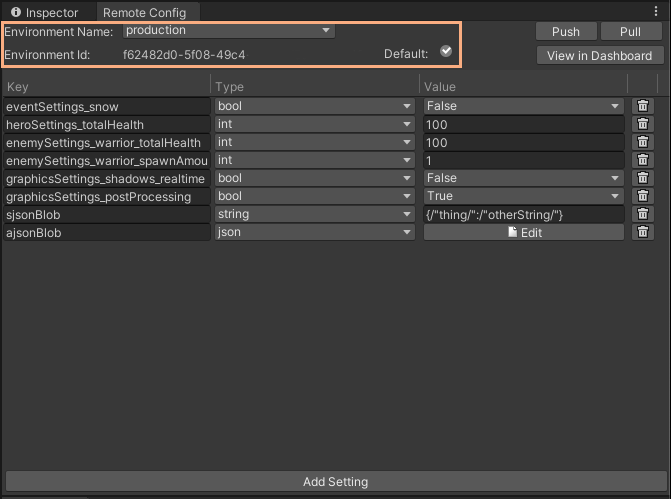
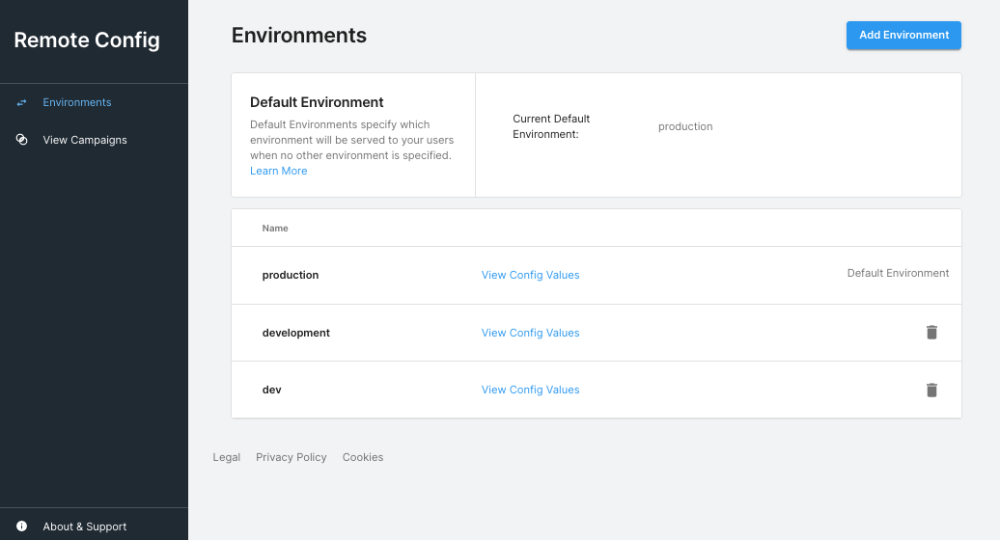
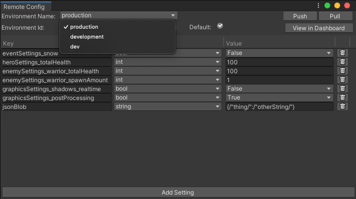

# Environments

Unity Remote Config Runtime uses Environments to group Campaigns and Settings, and deliver specific Environments to the client (Unity Runtime Instance) based on the `environmentId`. If no `environmentId` is provided in the request the default Environment `production` is returned to that instance.



Use the [Dashboard](http://dashboard.unity3d.com/remote-config) to manage your Remote Config Runtime Environments. Upon initialization in a new project, go to the  Dashboard to ensure Remote Config Window has successfully linked to the projectid, and pull the Environments.



**Note**: Each Environment has a unique set of Campaigns and Settings. Before you configure Campaigns and Settings for your game, select the correct Remote Config Environment in the **Remote Config** window.




## Restrictions

* A Project can have a maximum of 10 environments.
* Environment names must be unique.
* The `development` Environment name is reserved, and can't be created by users for users of `Remote Config SDK Version` <= `@1.1.x`.
* The `production` Environment name is reserved, and it's the default Environment. If an EnvironmentID is NOT specified in the request, the Environment `production` will be served.


## Working with Environments
The functionality of creation, editing, and deletion is available in the [Dashboard](WebDashboard.md) and is not available in the Editor.

Each Environment has the following main parameters.

| **Parameter** | **Description** |
| ------------- | --------------- |
| **Environment Name** | The readable identifier for the Environment. For example, you might name an Environment to match a given build of your game `com_Unity_MyGame-1_1_1`; or for a team member, to let them work independently of the Settings used by others `yourNameGoesHere`. This field is restricted to the character set [a-z, 0-9, -, _ ] |
| **Environment Id** | The generated UUID (universally unique identifier) for the Environment. The client uses this when requesting the Campaigns and Settings. <br>This parameter is required for integration.|
| **is Default** | This is not a user controllable flag as of 2021-07-30; the Environment Named `production` will be served as the default Environment for builds that do not specify an EnvironmentID|


### Selecting an Environment ID
You can set which `environmentId` the client requests with the method:

```c#
ConfigManager.SetEnvironmentID("001122-334455-6789");
```

### Selecting a non-default Environment
For package versions 1.1.0+, the instance can receive Campaigns and Settings from the non-default Environment named `production`. To specify this, use the ConfigManager API method `SetEnvironmentID` in the outgoing request.

#### Default Environment for 1.0.x package upgrades
- The `production` Environment is set as default when upgrading from an older version of the package.
- The `development` Environment is only delivered by default on Development Builds for packages <= 1.0.x.

## Example use cases
Below are some examples of how you can utilize Environments for your Project.

### Development workflow
Implement Settings Keys and Values that turn on and off features, or change assets to allow work in progress to be viewed in Playmode.

### Build-specific Environments
Tie specific builds of your Unity Project by coding in a specific EnvironmentID to enable distict Remote Config values to be delived to that build version.

### Levels or App sections
Set up specific environments to contain the Settings and Campaigns unique to a specific portion of the application or game, to break up the contents into logical bundles.

### Dynamic difficulty curve
Create Campaigns targeting players in specific levels, with Settings to dynamically adjust the number of enemies in the level, how much health they each have, and how much damage they inflict.

## Campaigns and Settings
Once you’ve configured your Environments, continue integrating by creating [Campaigns and Settings](CampaignsAndSettings.md).

## Upgrade Notes for Developers using Package Versions < 1.1.x

* Only the Development and Release Environments are available for use in versions of the package < 1.1.x
* Upon downgrading Environments other than `development` Environment and the Environment which is set as **default** `production` will still exist but not be usable for clients built by package versions <= 1.0.x .
* Upon downgrading to a package version <= 1.0.x, an Environment named `development` will be created if it did not already exist. This supports delivery to clients built as Development Builds for those older package versions.
